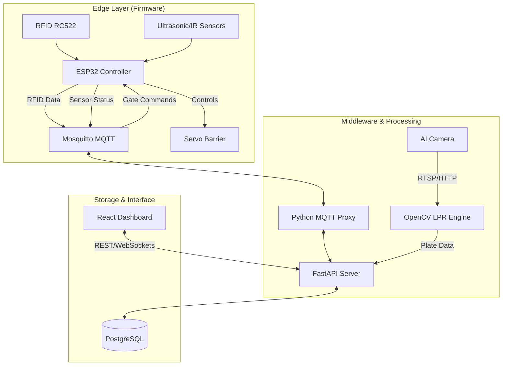

  # 🅿️ Smart Parking System
  ### AI-Powered License Plate Recognition & IoT Integration

  [](https://fastapi.tiangolo.com/)
  [](https://reactjs.org/)
  [](https://www.typescriptlang.org/)
  [](https://www.postgresql.org/)
  [](https://opencv.org/)
  [](https://www.espressif.com/)
</div>

---

## 🌟 Overview

The **Smart Parking System** is a comprehensive solution designed to automate parking management using Artificial Intelligence (AI) and the Internet of Things (IoT). By combining high-speed license plate recognition with real-time hardware control, this system eliminates manual ticketing and streamlines the parking experience.

> [!NOTE]
> This project was developed as a full-stack solution encompassing firmware (C++/ESP-IDF), backend (FastAPI), and frontend (React/Vite) technologies.

---

## 🚀 Key Features

- **🤖 Automated ALPR**: High-accuracy license plate recognition using AI cameras and OpenCV, removing the need for manual data entry.
- **🌐 Real-time IoT Control**: Seamless integration with ESP32 controllers to manage physical barriers, RFID authentication, and parking slot monitoring.
- **📊 Centralized Management**: A sleek React-based dashboard for real-time monitoring, revenue tracking, and system configuration.
- **💳 Intelligent Billing**: Dynamic fee calculation based on entry/exit timestamps with support for various pricing rules.
- **🛰️ MQTT Architecture**: Ultra-low latency communication between edge devices and the central server via Mosquitto MQTT.

---

## 🏗️ System Architecture



---

## 🛠️ Tech Stack

### **Frontend**
- **Framework**: React 19, Vite
- **Language**: TypeScript
- **Styling**: Tailwind CSS
- **Icons**: Lucide Icons
- **Data Fetching**: React Query

### **Backend**
- **Framework**: FastAPI (Python 3.12+)
- **ORM**: SQLAlchemy
- **AI/ML**: OpenCV (License Plate Recognition)
- **Communication**: Paho-MQTT, WebSockets

### **Hardware & Firmware**
- **Microcontroller**: ESP32 (ESP-IDF / C++)
- **Sensors**: RFID RC522, HC-SR04 Ultrasonic, IR Sensors
- **Actuators**: MG996R/SG90 Servos

---

## 🔌 Hardware Pinout (ESP32)

| Component | Pin | Function |
| :--- | :--- | :--- |
| **RFID SDA** | GPIO5 | SPI SS |
| **RFID SCK** | GPIO18 | SPI Clock |
| **RFID MOSI** | GPIO23 | SPI MOSI |
| **RFID MISO** | GPIO19 | SPI MISO |
| **RFID RST** | GPIO4 | Reset |
| **Servo (Entry)** | GPIO13 | Signal |
| **Servo (Exit)** | GPIO12 | Signal |
| **IR (Entry)** | GPIO25 | Sensor Input |
| **IR (Exit)** | GPIO26 | Sensor Input |
| **IR (Slot 1)** | GPIO34 | Occupancy |
| **IR (Slot 2)** | GPIO35 | Occupancy |
| **IR (Slot 3)** | GPIO32 | Occupancy |

---

## 💻 Installation & Setup

### 1. Firmware Setup
```bash
cd firmware
idf.py build
idf.py -p [PORT] flash monitor
```

### 2. Backend Setup
```bash
# Initialize Database & MQTT Proxy
python backend/mqtt_to_pg.py

# Start API Server
python backend/main.py

# Start ALPR Engine
cd backend/license_plate_recognize/lisence-plate
# Activate environment (Conda)
conda activate plate_detect
python main.py --camera 1 --port 8001 --gate entry
python main.py --camera 2 --port 8002 --gate exit
```

### 3. Frontend Setup
```bash
cd frontend
npm install
npm run dev
```

---


## 📄 License & Author

Distributed under the MIT License. See `LICENSE` for more information.

**Author**: Minh Quan Tran  
**Project Link**: [https://github.com/mquann004/Smart_Parking_System](https://github.com/mquann004/Smart_Parking_System)

---
<div align="center">
  Developed with ❤️ by Minh Quan Tran & Thanh Dat Nguyen
</div>
