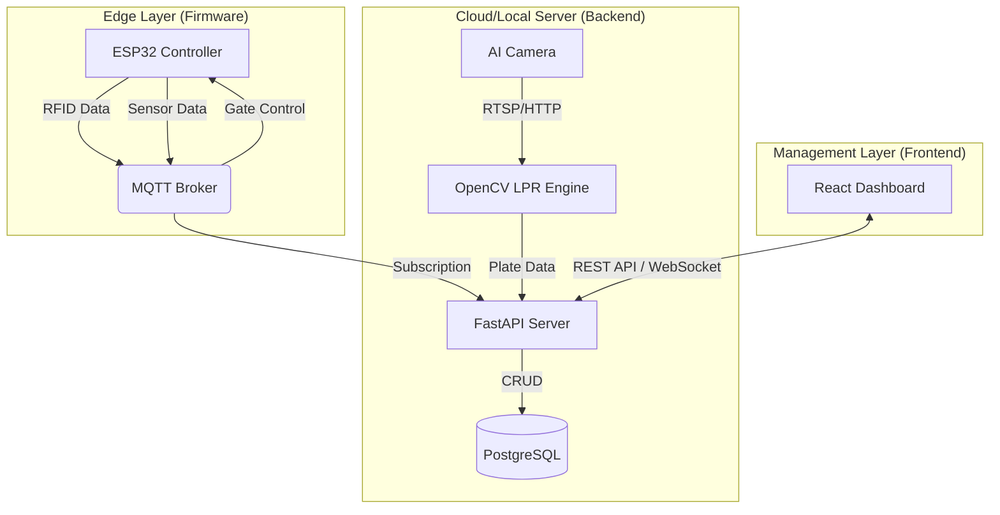

# 🚗 AI-Powered Smart Parking System

[](https://fastapi.tiangolo.com/)
[](https://reactjs.org/)
[](https://www.typescriptlang.org/)
[](https://docs.espressif.com/projects/esp-idf/en/latest/esp32/)
[](LICENSE)

A comprehensive, end-to-end IoT solution for modern parking management. This system integrates hardware-level control (ESP32), real-time communication (MQTT), AI-driven Computer Vision (License Plate Recognition), and a sleek administrative dashboard.

---

## 🏗️ System Architecture

The system follows a distributed architecture ensuring low latency and high scalability:



---

## 🌟 Key Features

### 🛠️ Hardware (Firmware)
- **RFID Access Control**: Secure entry/exit using RC522 RFID module.
- **Real-time Monitoring**: Distance sensors for occupancy detection.
- **MQTT Integration**: Reliable, low-overhead communication with the backend.
- **Fail-safe Logic**: Local control loops for gate operation during network instability.

### 🧠 Backend (AI & Logic)
- **Automatic License Plate Recognition (ALPR)**: Real-time image processing using OpenCV.
- **Intelligent Billing**: Dynamic fee calculation based on entry/exit timestamps.
- **Async Processing**: High-performance API built with FastAPI and asynchronous database drivers.
- **MQTT-to-DB Bridge**: Automated persistence of sensor data.

### 💻 Frontend (Dashboard)
- **Real-time UI**: Live status updates via React Query and WebSockets.
- **Professional Aesthetics**: Dark mode optimized, premium UI built with Tailwind CSS.
- **Management Tools**: User management, logs, and billing configuration.

---

## 🛠️ Tech Stack

- **Firmware**: C/C++ (ESP-IDF), MQTT Protocol.
- **Backend**: Python 3.12+, FastAPI, SQLAlchemy, OpenCV, Paho-MQTT.
- **Database**: PostgreSQL (Structured data & Logs).
- **Frontend**: React 19, TypeScript, Vite, Tailwind CSS, Lucide Icons, React Query.
- **Tools**: Docker (Optional), Git, ESP-Prog.

---

## 🚀 Getting Started

### Prerequisites
- Python 3.12+
- Node.js 20+
- ESP-IDF v5.0+
- PostgreSQL Instance
- MQTT Broker (e.g., Mosquitto)

### Installation

1. **Clone the repository**
   ```bash
   git clone https://github.com/yourusername/Smart_Parking.git
   cd Smart_Parking
   ```

2. **Backend Setup**
   ```bash
   cd backend
   python -m venv venv
   source venv/bin/activate  # venv\Scripts\activate on Windows
   pip install -r requirements.txt
   python main.py
   ```

3. **Frontend Setup**
   ```bash
   cd frontend
   npm install
   npm run dev
   ```

4. **Firmware Setup**
   - Open `firmware` folder in VS Code with ESP-IDF extension.
   - Configure Wi-Fi and MQTT credentials in `menuconfig`.
   - Build and Flash.

---

## 📜 License

Distributed under the MIT License. See `LICENSE` for more information.

---

## 📧 Contact

**Your Name** - [your.email@example.com](mailto:your.email@example.com)

Project Link: [https://github.com/yourusername/Smart_Parking](https://github.com/yourusername/Smart_Parking)
